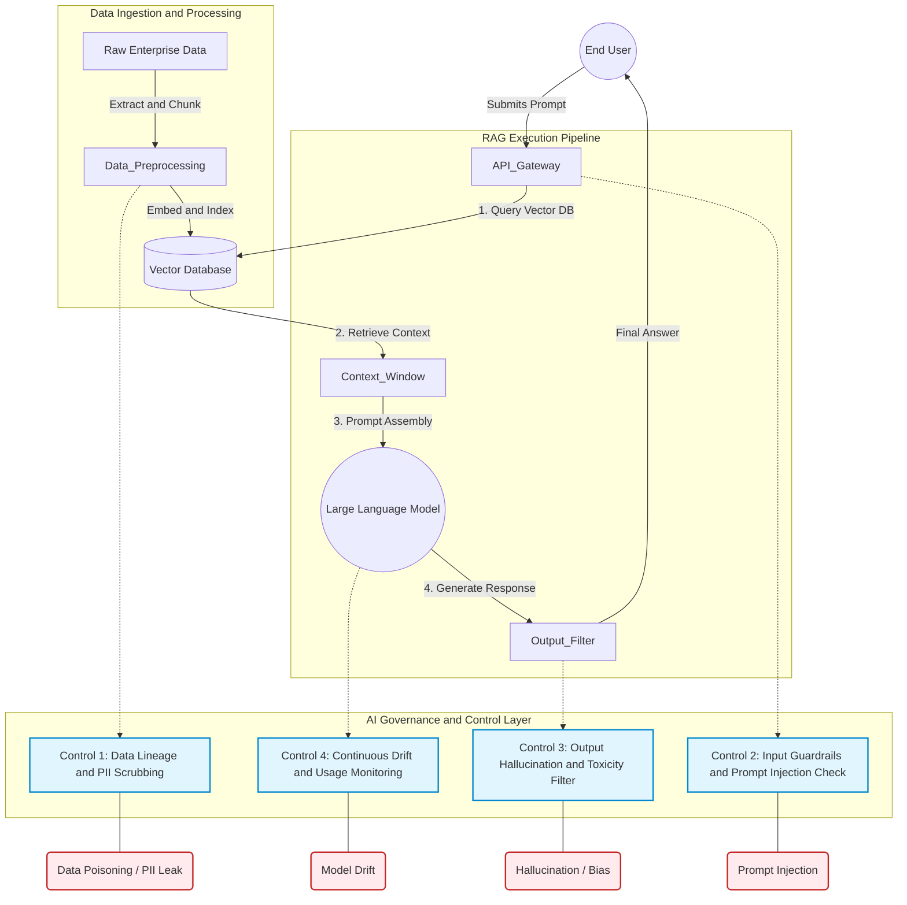

# Enterprise RAG Architecture & Governance Control Map

This diagram maps the technical flow of a Retrieval-Augmented Generation (RAG) system, overlaid with critical AI Governance checkpoints.

```mermaid
graph TD
    classDef gov fill:#e1f5fe,stroke:#0288d1,stroke-width:2px
    classDef risk fill:#ffebee,stroke:#c62828,stroke-width:2px

    User((End User)) -->|Submits Prompt| API_Gateway

    subgraph INGEST["Data Ingestion and Processing"]
        Raw_Data[Raw Enterprise Data] -->|Extract and Chunk| Data_Preprocessing
        Data_Preprocessing -->|Embed and Index| Vector_DB[(Vector Database)]
    end

    subgraph PIPE["RAG Execution Pipeline"]
        API_Gateway -->|1. Query Vector DB| Vector_DB
        Vector_DB -->|2. Retrieve Context| Context_Window
        Context_Window -->|3. Prompt Assembly| LLM((Large Language Model))
        LLM -->|4. Generate Response| Output_Filter
    end

    subgraph GOV["AI Governance and Control Layer"]
        Gov_Ingestion["Control 1: Data Lineage and PII Scrubbing"]:::gov
        Gov_Input["Control 2: Input Guardrails and Prompt Injection Check"]:::gov
        Gov_Output["Control 3: Output Hallucination and Toxicity Filter"]:::gov
        Gov_Monitor["Control 4: Continuous Drift and Usage Monitoring"]:::gov
    end

    Data_Preprocessing -.-> Gov_Ingestion
    API_Gateway -.-> Gov_Input
    Output_Filter -.-> Gov_Output
    LLM -.-> Gov_Monitor

    Output_Filter -->|Final Answer| User

    Risk_Data("Data Poisoning / PII Leak"):::risk
    Risk_Input("Prompt Injection"):::risk
    Risk_Output("Hallucination / Bias"):::risk
    Risk_Monitor("Model Drift"):::risk

    Gov_Ingestion --- Risk_Data
    Gov_Input --- Risk_Input
    Gov_Output --- Risk_Output
    Gov_Monitor --- Risk_Monitor
```